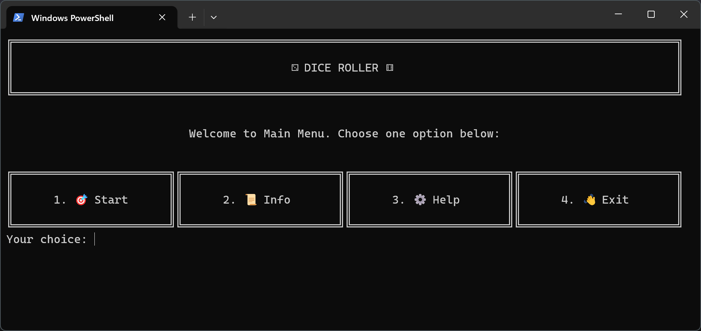

# Python Object-Oriented Dice Roller

A modular command-line dice simulator built with Python. This project demonstrates Object-Oriented Programming principles by separating logic, visual representation, and program flow into distinct files.

## Features

1. **Custom Configuration:** The user selects the type of dice (e.g. d6, d20) and the quantity to roll at once.
2. **Visual Output:** Results are displayed graphically in the console. The visual logic is encapsulated within the `Dice` class.
3. **Interactive Flow:**
The application allows navigation between two main states:

   * **The Main Menu:**
     * **Start Game:** Enters the simulation.
     * **Info Page:** Explains mechanics and lists supported dice (d4-d20).
     * **Help Page:** Author contact info.
     * **Exit:** Safe shutdown.

   * **The Game Loop (After Rolling):**
     * **Reroll:** Instantly roll again using the *same parameters* (Dice Type & Amount).
     * **New Settings:** Return to configuration to change dice type without quitting.
     * **Return to Menu:** Go back to the starting screen.

## How to Run

1. **Prerequisites:** Make sure you have Python 3.x installed.
2. **Download** the project files.
3. Open your terminal and navigate to the project folder:
```bash
cd path/to/dice_roller
```
4. **Install** dependencies:
```bash
pip install -r requirements.txt
```
5. **Run** the application:
```bash
python main.py
```

## Interface Preview

1. **The Main Menu:** Clean, table based navigation with emoji support.



2. **The Game:** Visual representation of dice results.

```text
╔══════════════════════════════════════════════════════════════════════════════════════════════════╗
║                                                                                                  ║
║                                    Insert desired dice type.                                     ║
║                                                                                                  ║
╚══════════════════════════════════════════════════════════════════════════════════════════════════╝


Possible options:d4, d6, d8, d10, d12, d20 : d6


Insert desired dice amount to throw: 4


    ________             ________             ________             ________
   /\       \           /\       \           /\       \           /\       \
  /  \       \         /  \       \         /  \       \         /  \       \
 /    \_______\       /    \_______\       /    \_______\       /    \_______\
 \    /       /       \    /       /       \    /       /       \    /       /
  \  /   2   /         \  /   6   /         \  /   5   /         \  /   5   /
   \/_______/           \/_______/           \/_______/           \/_______/


╔══════════════════════════════════════════════════════════════════════════════════════════════════╗
║                                                                                                  ║
║                                           Your throws:                                           ║
║                                                                                                  ║
╚══════════════════════════════════════════════════════════════════════════════════════════════════╝
╔══════════════════════════════════════════════════════════════════════════════════════════════════╗
║                                                                                                  ║
║                                            2, 6, 5, 5                                            ║
║                                                                                                  ║
╚══════════════════════════════════════════════════════════════════════════════════════════════════╝
╔══════════════════════════════════════════════════════════════════════════════════════════════════╗
║                                                                                                  ║
║                               ⚔️ Do you wish to play again? (y/n)                                ║
║                                                                                                  ║
╚══════════════════════════════════════════════════════════════════════════════════════════════════╝
Decision:
```

## Project Structure

The project follows a package based structure:

```text
dice_roller/
|
|_ main.py              # Entry point: Handles the main game loops
|
|_ README.md            # Project documentation
|
|_ requirements.txt     # Requirements file
|
|_ assets/              # Project assets
|   |
|   |_ main_menu.png    # Screenshot of apps main menu
|
|_ logic/               # Logic package
    |
    |_ __init__.py      # Makes the folder importable as a package
    |
    |_ dice.py          # Dice Class: Handles rolling logic and ASCII art definitions
    |
    |_ utils.py         # Helper Functions: Input validation, screen clearing, headers
```